# Лабораторная работа №1

## Цель работы

Освоить базовые команды Linux для навигации по файловой системе, создания каталогов и файлов, копирования, переименования, создания ссылок и удаления объектов.

## Теоретические сведения

В ходе работы используются следующие команды:

- `pwd` — показывает текущий рабочий каталог.
- `cd` — позволяет переходить между каталогами.
- `ls` — показывает содержимое каталога.
- `mkdir` — создаёт каталог.
- `touch` — создаёт пустой файл.
- `mv` — перемещает или переименовывает файл.
- `cp` — копирует файлы.
- `ln` — создаёт жёсткие и символические ссылки.
- `rm` — удаляет файлы.
- `rmdir` — удаляет пустые каталоги.
- `man` — выводит справку по команде.

## Ход выполнения

### 1. Просмотр справки по `pwd` и определение текущего каталога

Была вызвана справка по команде `pwd`, после чего определён текущий каталог:

```bash
man pwd
pwd
```

**Скриншоты:**

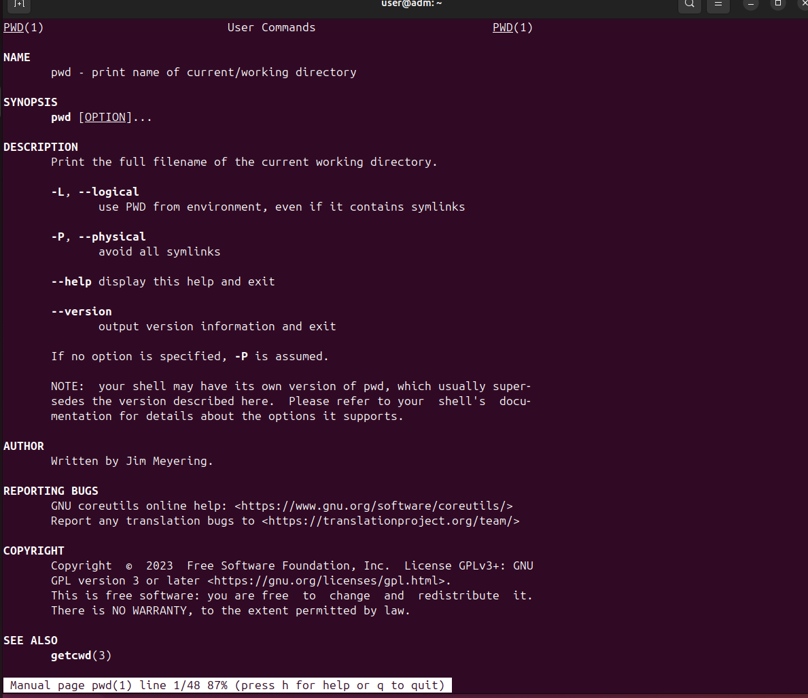

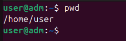

### 2. Просмотр справки по `cd` и переход в корневой каталог

```bash
man cd
cd /
```

**Скриншот:**

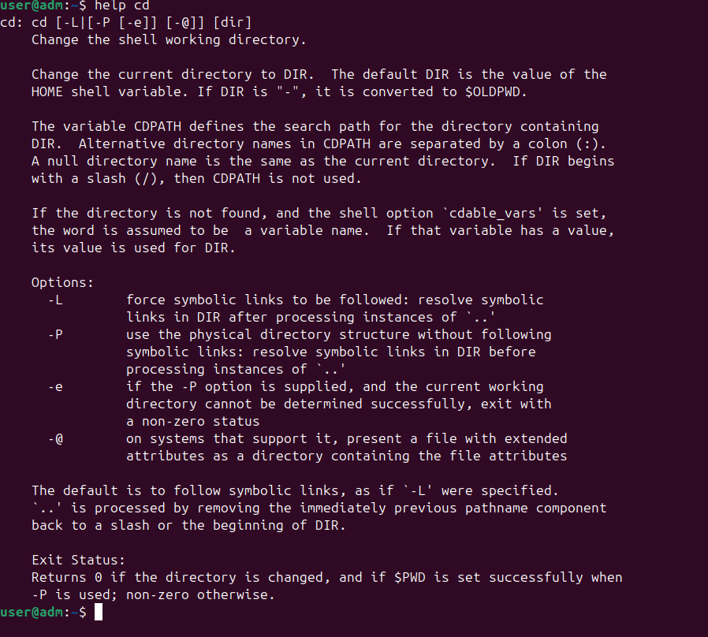

### 3. Просмотр содержимого корневого каталога

```bash
man ls
ls
```

**Скриншот:**

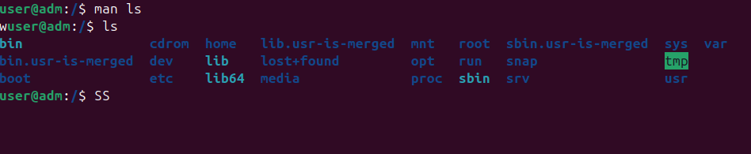

### 4. Возврат в домашний каталог

```bash
cd
```

или

```bash
cd ~
```

### 5. Создание каталога `test`, переход в него и просмотр содержимого

```bash
man mkdir
mkdir test
cd test
ls
```

**Скриншот:**

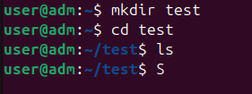

### 6. Создание каталога `test2` внутри `test`

```bash
mkdir test2
```

**Скриншот:**

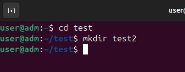

### 7. Создание файла `text` в каталоге `test2`

```bash
man touch
touch test2/text
```

### 8. Переименование файла `text` в `textSIT`

```bash
man mv
mv test2/text test2/textSIT
```

**Скриншот:**

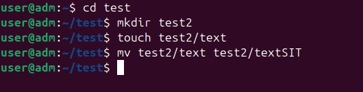

### 9. Копирование файла `textSIT` в `copy.txt`

```bash
man cp
cp test2/textSIT test2/copy.txt
```

### 10. Создание жёсткой и символической ссылки

Жёсткая ссылка `link` на файл `test2/copy.txt`:

```bash
man ln
ln test2/copy.txt link
```

Символическая ссылка `simlink` на файл `test2/copy.txt`:

```bash
ln -s test2/copy.txt simlink
```

**Скриншот:**

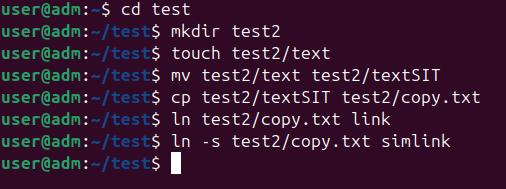

### 11. Просмотр содержимого каталога с аргументами `-la`

```bash
ls -la
```

**Скриншот:**

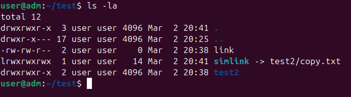

### 12. Удаление созданных файлов и ссылок

Удаление ссылок в каталоге `test`:

```bash
rm link simlink
```

Удаление файлов в каталоге `test2`:

```bash
rm test2/textSIT test2/copy.txt
```

Удаление пустого каталога `test2`:

```bash
rmdir test2
```

**Скриншот:**

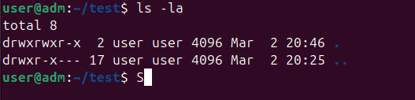

## Результаты

В результате выполнения лабораторной работы были отработаны основные команды Linux для:

- навигации по файловой системе;
- просмотра содержимого каталогов;
- создания каталогов и файлов;
- переименования и копирования файлов;
- создания жёстких и символических ссылок;
- удаления файлов и каталогов.

## Выводы

В ходе выполнения лабораторной работы были изучены базовые команды терминала Linux и получены практические навыки работы с файловой системой. Работа позволила понять принципы перемещения по каталогам, создания и удаления объектов, а также особенности работы с разными типами ссылок.

## Приложение

Ниже приведён дополнительный общий скриншот терминальной сессии, объединяющий несколько этапов выполнения работы.

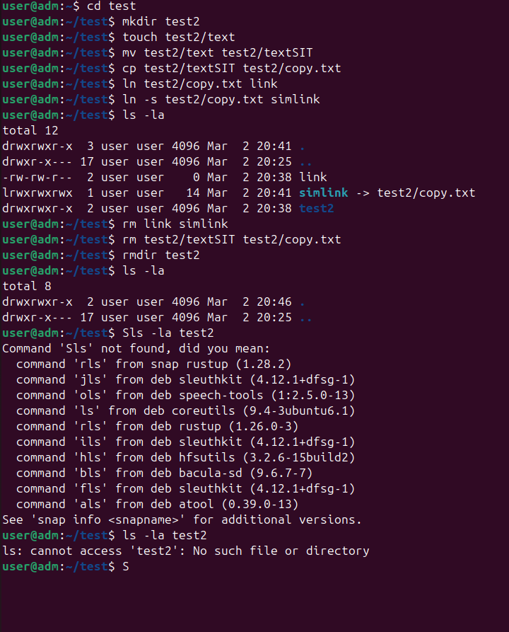
