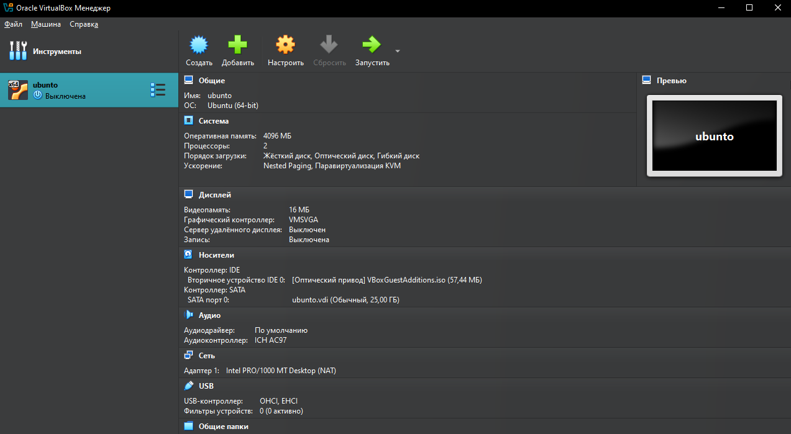
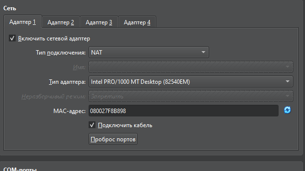
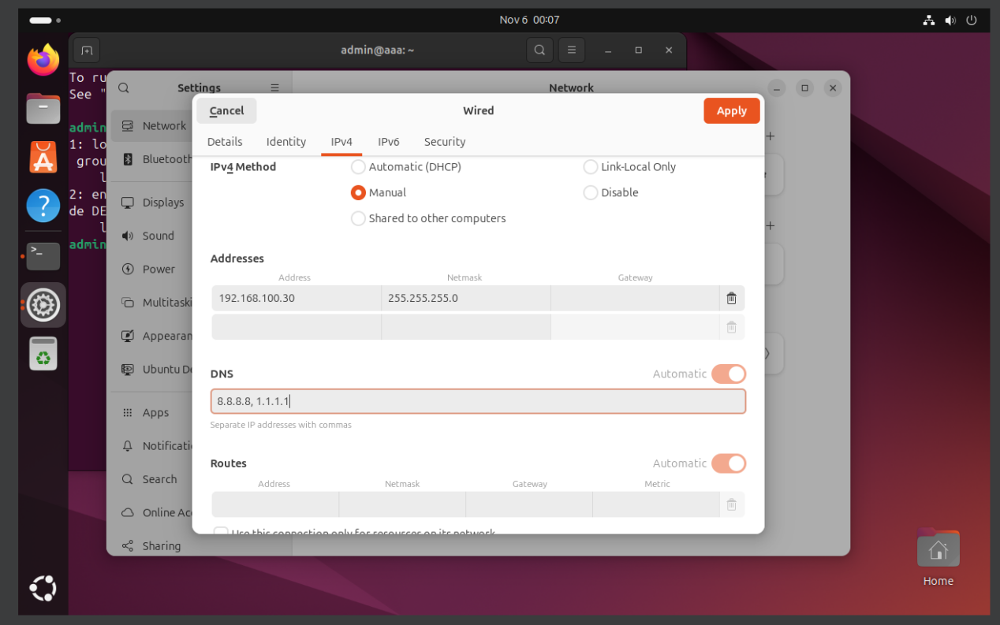

# Лабораторная работа: установка Linux в Oracle VirtualBox

## Цель работы

В ходе лабораторной работы была выполнена установка операционной системы Linux на виртуальную машину. В качестве дистрибутива использовалась Ubuntu, а для запуска виртуальной машины применялась программа Oracle VirtualBox.

Также была выполнена базовая настройка виртуальной машины и сетевого подключения, чтобы установленная система могла работать в изолированной среде и иметь доступ к сети.

## Используемое программное обеспечение

- Oracle VirtualBox;
- ISO-образ Ubuntu Linux;
- виртуальная машина с типом ОС `Ubuntu (64-bit)`.

## Ход выполнения работы

### 1. Создание и подготовка виртуальной машины

Сначала в Oracle VirtualBox была создана виртуальная машина с именем `ubuntu`. Для нее был выбран тип операционной системы `Ubuntu (64-bit)`.

Для нормальной работы системы были выделены следующие ресурсы:

| Параметр | Значение |
|---|---:|
| Оперативная память | 4096 МБ |
| Количество процессоров | 2 |
| Тип виртуального диска | VDI |
| Размер виртуального диска | 25 ГБ |
| Графический контроллер | VMSVGA |
| Видеопамять | 16 МБ |
| Сетевой режим | NAT |

После создания виртуальной машины был подключен установочный ISO-образ Ubuntu. Далее виртуальная машина была запущена для начала установки Linux.



### 2. Установка Ubuntu Linux

После запуска виртуальной машины началась установка Ubuntu. В процессе установки были выполнены стандартные действия:

1. выбран язык установщика;
2. выбран вариант установки Ubuntu;
3. настроена раскладка клавиатуры;
4. выбран виртуальный диск для установки системы;
5. создан пользователь системы;
6. начато копирование файлов операционной системы;
7. после завершения установки виртуальная машина была перезагружена.

После перезагрузки система запустилась уже с виртуального жесткого диска, что означает успешную установку Linux.

### 3. Настройка сетевого адаптера VirtualBox

После установки системы была проверена настройка сетевого адаптера виртуальной машины. В VirtualBox для адаптера был включен режим NAT. Этот режим позволяет виртуальной машине получать доступ к сети через сетевое подключение основного компьютера.

Также была включена опция подключения сетевого кабеля, чтобы гостевая система могла использовать сетевой интерфейс.



### 4. Первичный запуск установленной системы

После установки Ubuntu был выполнен вход в систему. На рабочем столе Ubuntu были открыты настройки сети, чтобы проверить и настроить параметры подключения.

Система успешно загрузилась, что подтверждает корректную установку Linux в виртуальной машине.

### 5. Настройка IPv4 в Ubuntu

В настройках проводного подключения Ubuntu был открыт раздел IPv4. Для сетевого интерфейса был выбран ручной способ настройки адресации.

Были указаны следующие параметры:

| Параметр | Значение |
|---|---:|
| IP-адрес | `192.168.100.30` |
| Маска подсети | `255.255.255.0` |
| DNS-серверы | `8.8.8.8`, `1.1.1.1` |
| Метод IPv4 | Manual |

После ввода параметров были применены настройки сети.



### 6. Проверка результата

Для проверки корректности установки и настройки системы можно использовать следующие команды в терминале Ubuntu:

```bash
ip a
```

Команда показывает список сетевых интерфейсов и назначенные им IP-адреса.

```bash
ping 8.8.8.8
```

Команда проверяет доступность сети по IP-адресу.

```bash
ping google.com
```

Команда проверяет работу DNS-серверов и доступ к интернету по доменному имени.

## Результат работы

В результате лабораторной работы была установлена операционная система Linux Ubuntu в виртуальной машине Oracle VirtualBox. Для виртуальной машины были выделены необходимые ресурсы: оперативная память, процессоры, виртуальный жесткий диск и сетевой адаптер.

После установки была выполнена настройка сети: в VirtualBox использовался режим NAT, а в Ubuntu были заданы параметры IPv4 и DNS. Установленная система успешно запустилась и была готова к дальнейшей работе.

## Вывод

В ходе лабораторной работы были получены практические навыки установки Linux в виртуальной среде. Были изучены основные этапы создания виртуальной машины, установки Ubuntu, настройки сетевого адаптера и ручной настройки IPv4-параметров в установленной системе.
